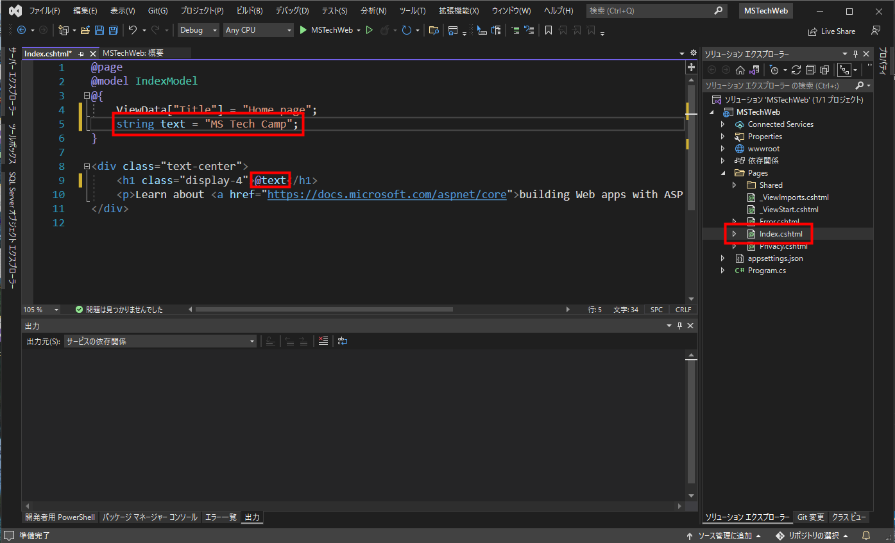
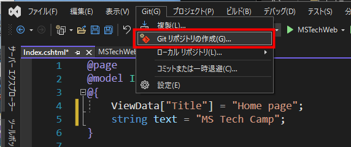

# ASP.NET Core と Azure Web Apps でできる！簡単 Web サイト作成＆公開デモ
 LTで紹介した ASP.NET Core  Web アプリ公開デモの手順書です。 
 実際に手を動かしてみたい方向けの手順書になります。

# 手順の概要
ASP.NET Core のプロジェクトテンプレートを使用して Web ページを作成し、Azure Web Apps で公開します。必要な手順は大まかに分けて 3 ステップになります。

1. ASP.NET Core のプロジェクト作成
2. GitHub リポジトリへのプッシュ
3. Azure Web Apps のインスタンス作成

たったこれだけで Web ページを公開できます。所要時間は5分ほど（GitHub ワークフローで2分弱）です。

## STEP1 ASP.NET Core プロジェクト作成

まず、プロジェクトを作成するには Visual Studio の機能で「ASP.NET と Web 開発」が必要です。導入できていない方は Visual Studio Installer からセットアップしてください。

1. Visual Studio にて「新しいプロジェクトの作成」を選択

2. 「ASP.NET Core Web アプリ」を選択

3. プロジェクト名を適当に決めて次へ

4. フレームワークは最新のものを選択して作成

5. `Page` ディレクトリ内にある `Index.cshtml` を開いて、一部プログラムを追記してみる。

これでプロジェクトの作成は完了です。

## STEP2 GitHub リポジトリへのプッシュ

1. 上部のタブから「Git」を選択し、「Gitリポジトリの作成」をクリック

2. 「作成とプッシュ」をクリック（プライベートリポジトリでもOK）

3. タスクが完了していることを確認

## STEP3 Azure Web Apps のインスタンス作成

1. Azure ポータルを開く

2. リソースの作成をクリック

3. Web アプリを選択（一覧になければ検索してください）

4. 必要事項へ記入する

名前の部分は URL になります。 ランタイムは先程作成した ASP.NET Core のフレームワークに合わせてください。

|項目|記入例|
|--|--|
|サブスクリプション|Azure for Students|
|リソースグループ|rg-mstechcamp|
|名前|takunology-web|
|公開|コード|
|ランタイムスタック|.NET 6|
|オペレーティングシステム|Windows|
|地域|Japan East|
|Windows プラン|そのまま|
|SKUとサイズ|Free F1|

SKU とサイズに関しては `サイズを変更します` のリンクから選択することができます。

「開発/ワークロード」から無料プランを選択し、適用をクリックすると無料で作ることができます。

5. 「次:デプロイ」をクリック

6. 継続的デプロイを有効化し、GitHub と連携する

7. 先程プッシュしたリポジトリを選択して「確認および作成」をクリック

8. 内容を確認して「作成」をクリック

9. リソースへ移動をクリック

これでリソースの作成と GitHub との連携は完了です！

## Web ページの確認

インスタンス作成時に、GitHub のワークフローが動いていますので、リポジトリに移動して確認してみます。プッシュしたリポジトリから `Action` をクリックすると、実行中のワークフローが表示されます。

画像のように、チェックマークが入っていればデプロイが完了し、Webサイトが公開されています。 

Azure のリソースから、参照をクリックしてみてください。

先程作成した Web ページが公開されています。URLは `azurewebsites` ドメインとなります。

これで、Web ページの作成&デプロイは完了です！ 

Web ページを更新したらリポジトリにコミットして GitHub にプッシュするだけで即座に Azure Web apps へデプロイされます。

## リソースの削除
Web ページを運用する必要がなくなった場合は Azure のリソースを削除しましょう。 

Azure ポータルから「リソースグループ」を選択し、今回作成したリソースグループ名を選択します。（この例では `rg-mstechcamp` です。） 

